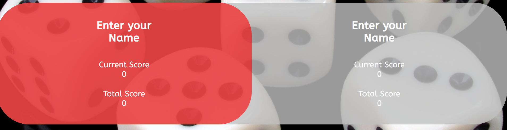
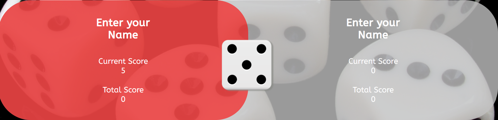
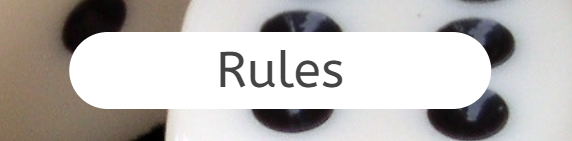
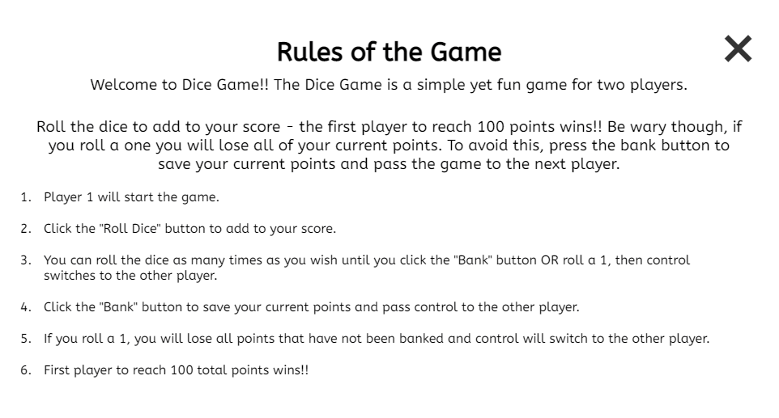
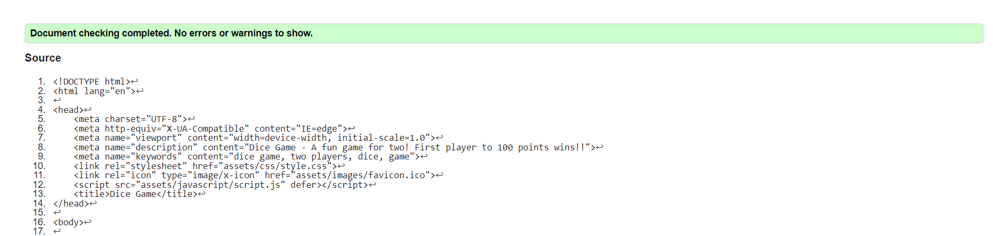
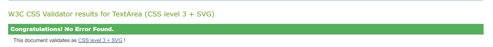
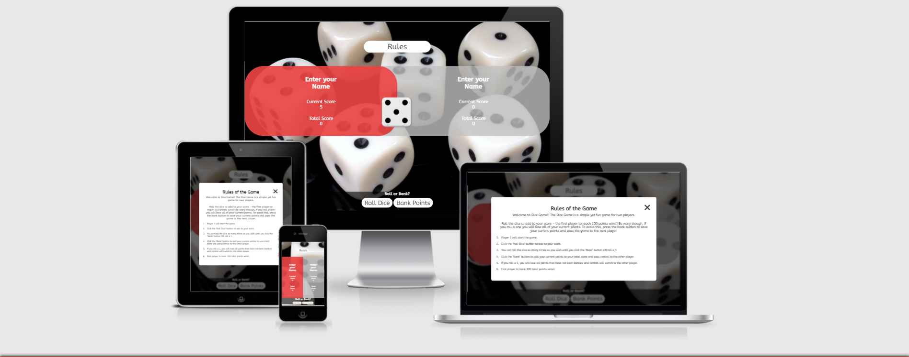

# Dice Game

## Project Overview

The Dice Game is a simple yet fun game for two players. Roll the dice to add to your score - the first player to reach 100 points wins!! Be wary though, if you roll a one you will lose all of your current points. To avoid this, press the bank button to save your current points and pass the game to the next player.

You can view the published site [here](https://stephenb92.github.io/javascript-portfolio-project/).

## Design

1. Colour Scheme
* The 3 main colours present on the screen are Black, White and Red. This creates a consistent scheme on the page while also being visually attractive.

2. Typography
* The ABeeZee font was selected as the main font of the game with Sans-Serif as the fall back font in case the ABeeZee font cannot be imported for any reason. ABeeZee was selected as it is clean and modern looking as well as being lighthearted.

3. Imagery
* The background image chosen is a black background with 6 dice displayed. This of course is fitting due to the game itself while the colour scheme also does not distract from it.

## Wireframes

### Desktop

1. Please find the wireframe for the main game page on a desktop [here](assets/wireframes/desktop/main-page-desktop.png).
2. Please find the wireframe for the rules modal on a desktop [here](assets/wireframes/desktop/rules-modal-desktop.png).

### Tablet

1. Please find the wireframe for the main game page on a tablet [here](assets/wireframes/tablet/main-page-tablet.png).
2. Please find the wireframe for the rules modal on a tablet [here](assets/wireframes/tablet/rules-modal-tablet.png).

### Mobile

1. Please find the wireframe for the main game page on a mobile device [here](assets/wireframes/mobile/main-page-mobile.png).
2. Please find the wireframe for the rules modal on a mobile device [here](assets/wireframes/mobile/rules-modal-mobile.png).

## Coding Languages Used

1. HTML 5
2. CSS3
3. JavaScript

## Features

### Existing Features

1. The Dice Game Main Page. 
- Here we have the main game page for Dice Game. This displays players 1 and 2 and their respective scores. The goal of both players is to reach 100 in their Total Score.
- Between the scores for both players - an image of the dice rolled last is displayed in between when players click the "Roll Dice" button.
- The "New Game" button, which appears only when the current game is over and replaces the image of the dice, will reset the game to it's initial state when clicked.
- The "Rules" button on the top of the page, when clicked opens a modal window that contains a short description of the game along with the rules.
- Players can also click on the "Enter Your Name" text and a prompt window will appear asking the player to type in their name. What they enter will then appear on the Main Page.

2. The Rules modal window
- As mentioned above, this window will only appear when the "Rules" button on the main game page is clicked.
- This window contains a description of the game along with its rules.
- The user can close this modal window by clicking the "X" in the top right corner, clicking outside of the modal window or even by pressing the "Escape" key.

3. The section with the game controls.
- The text above the controls summarises the functions of both buttons - "Roll or Bank?"
- When the active player clicks the "Roll Dice" button, a JavaScript function is called in the background that will generate a random dice between 1 - 6. The number appearing on that dice will be added to the active players "Current Score" (unless a 1 is rolled) and an image of that dice will be displayed in the center of the main game area.
- When the active player clicks the "Bank Points" button, a separate JavaScript funcion is called the will add the number currently displayed as the "Current Score" to the active players "Total Score". Clicking this button will also end the active players turn and control will switch to the other player.

### Future Features

1. Play against the computer functionality
* In a future update, I would like to include an additional button on the main game area that allows the user to play against the computer if another player is not available.
2. Track Game Points
* In a future update, I would like to include a feature that counts how many games a player has won and therefore add an extra level to the game, such as "best out of three".

## Testing

### Validator Testing

1. HTML - No errors were returned on any of the project pages when passing through the official [W3C Markup Validator](https://validator.w3.org/).

2. CSS - No errors found when passing through the official [W3C Jigsaw Validator](https://jigsaw.w3.org/css-validator/validator).

3. JavaScript - No errors, warnings or problems appearing on the jshint extension installed in Gitpod. I created a .jshintrc file located in the javascript folder with the "esversion" set to 6. 

### Lighthouse Testing

The page has been also tested using Lighthouse on Chrome Dev Tools.

1. Desktop results [here](assets/testing-screenshots/desktop-lighthouse-results.png).
2. Mobile results [here](assets/testing-screenshots/mobile-lighthouse-results.png).

### Responsive Design

The project has been tested through [Am I responsive](http://ami.responsivedesign.is/) and is responsive on all devices.

## Bugs and Fixes

1. In the early stages of the project, I had an issue where I was unable to move the main game board to the center of the screen. I discovered that this was due to there being no height set for the body of the HTML document. Once I had added the appropriate height setting to the body, I was then free to position the main game page as desired.
2. I experienced an issue with the "Enter your Name" function where the text entered in the prompt window was not then appearing in the HTML page. This was due to me using the    
.getElementsByClassName function method rather than .querySelector. Once I changed the method to 
.querySelector, the text entered in the prompt window appeared in the main game area as intended.
3. I experienced an issue when coding to remove the game controls when a player has won and the game is over, only to re-appear when the "New Game" button is clicked. Otherwise, players would be able to keep clicking buttons and adding to scores despite the game being over. The existing styling I had on the controls section was overriding the "Hide" class I attempted to add using a JavaScript function. I had tried using "!important" which did work, but as this is not industry standard and gernerally disliked, I found the solution was to remove the existing class on the controls section and then add the "Hide" class using Javascript.

## Deployment on GitHub

The project was deployed to GitHub Pages using the following steps...

1. Log in to GitHub and locate the GitHub [repository](https://github.com/StephenB92/javascript-portfolio-project).
2. In the GitHub repository, navigate to the Settings tab.
3. In the Settings, navigate to the GitHub Pages section.
4. From the source section drop-down menu, select the main branch.
5. Once the main branch is selected, click on save.
6. Once save has been clicked, the page will refresh and a link to the successfully deployed project is shown.

## Credits

### Code
- Credit to Jonas Schmedmann and the Udemy course [The Complete Javascript Course 2022: 
From Zero to Expert](https://www.udemy.com/course/the-complete-javascript-course/) where the template of the Dice Game was found and used in this project. The front-end layout and some of the styling was used as a template for this project also.
- Credit to Jonas Schmedmann and the Udemy course [The Complete Javascript Course 2022: 
From Zero to Expert](https://www.udemy.com/course/the-complete-javascript-course/) where the JavaScript code for the Roll Dice, Bank Points, Switch Player and New Game functions were found and used in this project.
- Credit to Jonas Schmedmann and the Udemy course [The Complete Javascript Course 2022: 
From Zero to Expert](https://www.udemy.com/course/the-complete-javascript-course/) for the code used to create and style the "rules" modal window. As the project being created was also inspired by another module on this project, the separate modal window section was a good fit for the intended project and the inclusion of the feature to display the rules to the players without needlessly cluttering the main game page.
- Credit to my mentor Narender Singh for the solution to fixing the bug mentioned above affecting the coding to remove the game controls when a player has won and the game is over.
- Credit to [Golang](https://www.golangprograms.com/example-to-take-user-input-and-display-on-screen-using-javascript.html) for information and code used to implement feature allowing users to enter their names to the main page.
- Credit to [codepen.io](https://codepen.io/LukeAskew/pen/gabgom) for information and code used for the animation that appears when users hover over the "Enter Your Name" text.

### Media

- Credit to [Clip Art Library](http://clipart-library.com/) for the dice images used in the game.
- Credit to [Pexels](https://www.pexels.com/photo/6-pieces-of-black-and-white-dice-37534/) for the background image appearing in the game.

### Acknowledgements

- My mentor Narender Singh for continuous helpful feedback.
- Tutor support at Code Institute for their support.