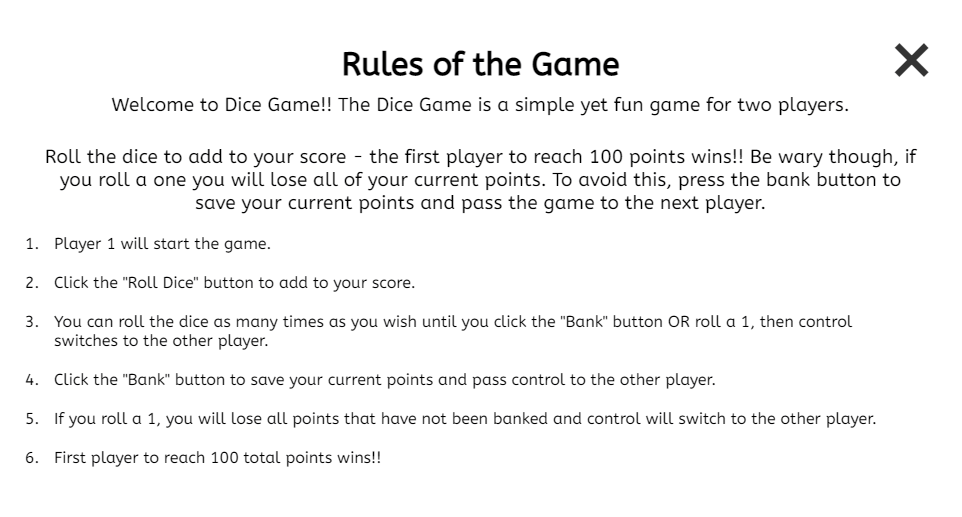

# Dice Game

## Project Overview

The Dice Game is a simple yet fun game for two players. Roll the dice to add to your score - the first player to reach 100 points wins!! Be wary though, if you roll a one you will lose all of your current points. To avoid this, press the bank button to save your current points and pass the game to the next player.

## Features

### Existing Features

1. The Dice Game Main Page. 
- Here we have the main game page for Dice Game. This displays players 1 and 2 and their respective scores. The goal of both players is to reach 100 in their Total Score.
- Between the scores for both players - you can see the interactive buttons labelled "New Game" and "Rules" with an image of the dice rolled last displayed in between.
- The "New Game" button, which appears only when the current game is over, will reset the game to it's initial state when clicked.
- The "Rules" button when clicked opens a modal window that contains a short description of the game along with the rules.

2. The Rules modal window
- As mentioned above, this window will only appear when the "Rules" button on the main game page is clicked.
- This window contains a description of the game along with its rules.
- The user can close this modal window by clicking the "X" in the top right corner, clicking outside of the modal window or even by pressing the "Escape" key.

3. The footer with the game controls.
- The text above the controls summarises the functions of both buttons - "Roll or Bank?"
- When the active player clicks the "Roll Dice" button, a JavaScript function is called in the background that will generate a random dice between 1 - 6. The number appearing on that dice will be added to the active players "Current Score" (unless a 1 is rolled) and an image of that dice will be displayed in the center of the main game area.
- When the active player clicks the "Bank Points" button, a separate JavaScript funcion is called the will add the number currently displayed as the "Current Score" to the active players "Total Score". Clicking this button will also end the active players turn and control will switch to the other player.

### Future Features

1. Play against the computer functionality
- In a future update, I would like to include an additional button on the main game area that allows the user to play against the computer if another player is not available.

## Wireframes

### Desktop
1. Please find the wireframe for the main game page [here.](assets/wireframes/desktop/main-page.png)
2. Please find the wireframe for the rules modal window [here.](assets/wireframes/desktop/rules-modal.png)

## Coding Languages Used

1. HTML 5
2. CSS3
3. JavaScript

## Credit

### Code
- Credit to Jonas Schmedmann and the Udemy course [The Complete Javascript Course 2022: 
From Zero to Expert, Modal Window Section](https://www.udemy.com/course/the-complete-javascript-course/learn/lecture/22648433#questions) for the code used to create and style the "rules" modal window. As the project being created was also inspired by another module on this project, the separate modal window section was a good fit for the intended project and the inclusion of the feature to display the rules to the players without needlessly cluttering the main game page.
- Credit to [Golang](https://www.golangprograms.com/example-to-take-user-input-and-display-on-screen-using-javascript.html) for information and code used to implement feature allowing users to enter their names to the main page.

### Media

- Credit to [Clip Art Library](http://clipart-library.com/) for the dice images used in the game.
